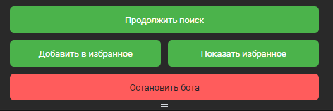

# Часто задаваемые вопросы (ЧАВО)
## 1. Где найти бота?
* Бот расположен по адресу https://vk.com/public216544992
  
## 2. Что делает бот?
* Программа-бот для взаимодействия с базами данных социальной сети. Бот будет предлагать различные варианты людей для знакомств в социальной сети Вконтакте в виде диалога с пользователем

## 3. Как работает бот?
* Используя информацию (возраст, пол, город) о пользователе, который общается с ботом в ВК, происходит поиск других людей (других пользователей ВК) для знакомств

## 4. Как начать пользоваться ботом?
  * Необходимо пройти по ссылке [бот](https://vk.com/public216544992),    
  
  * Нажать на кнпоку 
  
  >.
  
  * Когда откроется окно чата 
  
  > 
   
  внизу экрана необходимо нажать на кнопку "Начать" 

  >

  * После того как бот вас идентифицировал появятся дополнительные пункты меню для работы с ботом:
    * Начать поиск
    * Добавить в избранное
    * Показать избранное
  
  >
