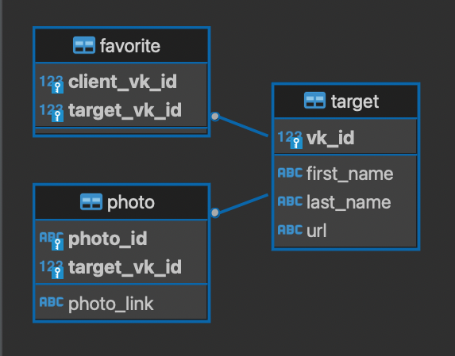

# Техническое описание проекта

## Схема базы данных
>

## Модуль src/config.py
>Содержит в себе конфигурационные классы и вспомогательную функцию для конвертации значений

## Модуль src/main.py
>Модуль создания базы данных и запуска бота

## Модуль src/vkbot/db/data_classes.py
>Содержит в себе классы и методы, обеспечивающее передачу полезной нагрузки между элементами проекта

## Модуль src/vkbot/db/db_interface.py
>Содержит в себе класс, обеспечивающий взаимодействие других модулей и классов с БД

## Модуль src/vkbot/db/db_tables.py
>Содержит в себе скрипт создания таблиц базы данных

## Модуль src/vkbot/utils/logger.py  
>Модуль содержит декоратор для логирования

## Модуль src/vkbot/vk_bot.py
>Модуль, в котором заложена основная логика работы бота

## Модуль src/vkbot/vk_group_api.py  
>Модуль для взаимодействия с API VK с токеном сообщества

## Модуль src/vkbot/vk_menu_api.py
>Модуль для создания контекстного меню бота

## Модуль src/vkbot/vk_user_api.py
>Модуль для взаимодействия с API VK с токеном пользователя

---
---

# Инструкция по эксплуатации бота:
1. Сохранить проект на жесткий диск компьютера, с которого планируется его запуск;
2. Подготовить (создать) базу данных PostgreSQL в соответствии с документацией сервера PostgreSQL;
3. Переименовать файл .env.example в .env, задать в нем сделующие параметры:
 
    *Параметры подключения к БД на сервере ostregSQL:*
    > - DB_HOST - адрес сервера;
    > - DB_PORT - порт сервера;
    > - DB_NAME - имя БД;
    > - DB_USER - имя пользователя;
    > - DB_PASSWORD - пароль.
    
    *Параметры API VK и бота:*
    > - VK_GROUP_TOKEN - токен группы ВК
    > - VK_USER_TOKEN - токен пользователя
    > - VK_GROUP_ID - ID группы VK
    > - VK_CLIENT_TIMEOUT_SEC - время (сек), по истечении которого диалог с клиентом будет считаться устаревшим (произойдет его удаление из оперативной памяти бота при получении любого события от любого пользоватея). Параметр игнорируется, если активен только один пользователь. Параметр не влияет на сохраненную информацию в БД ("избранные" пользователя).
 
    *Прочие параметры:*
    > - DB_DROP_TABLES_AFTER_LAUNCH - удалить таблицы при запуске бота? (True/False)

4. Удовлетворить зависимости из requirements.txt;
5. Запустить main.py.